The label propagation method 1 is a fast, iterative and non-deterministic method for partitioning networks 
into disjoint communities. The algorithm can thus lead to different community structures starting from the same 
initial state. The method uses the network structure to determine the communities and does not require any external 
parameter settings, such as the desired number of clusters and other preliminary information.
At the beginning of this procedure, each node is assigned a unique label. The individual nodes are then placed in a 
random order. Then
each node is assigned the most frequent label of its neighboring nodes. If several labels with the same maximum 
frequency occur in the neighboring nodes, one of these labels is chosen at random.
In order to avoid oscillations, as they occur with bipartite (paired) subgraphs, labels are updated asynchronously, 
i.e. the newly assigned labels take effect during the iteration. effective during the iteration.

Note: A graph is called bipartite if its nodes can be divided into two sets so that only edges exist between the nodes 
of one set and those of the other set.

Ideally, the iterative process should end when no node in the network changes its label. However, since nodes can 
exist in the network that have the same most frequent number of neighbors in two or more communities and a random 
decision is made for one of the candidates, the labels in such nodes can change even if the labels of the neighbors 
remain constant. Therefore, the termination condition is that each node has one of the labels that most of its 
neighboring nodes have. most of its neighboring nodes have. This creates a partition of the network into disjoint 
communities, in which each node has at least as many neighbors within its of its community as it has neighbors in 
every other community.

Runetime: Initialization of each node with a unique label required: O(n). Each iteration requires: O(m)

(m corresponds to the number of edges and n to the number of nodes in the network)

1 U. N. Raghavan, R. Albert und S. Kumara. Near linear time algorithm to detect
community structures in large-scale networks. Phys. Rev. E, 76:036106, Sep 2007.

Example data:

A Wikipedia entry lists all municipalities and towns in the federal state of North Rhine-Westphalia (Germany). There are 23 cities and 373 municipalities, making a total of 396 cities and municipalities in North Rhine-Westphalia. All cities and municipalities have their own entry in Wikipedia. Each Wikipedia entry for a city or municipality in the federal state of North Rhine-Westphalia contains links to other cities and municipalities in North Rhine-Westphalia. This is how a network can be defined. A city or municipality is connected to another city or municipality if its Wikipedia entry contains a link to the other municipality or city. The network defined in this way has 396 nodes and 8373 edges.

### Undirected graph

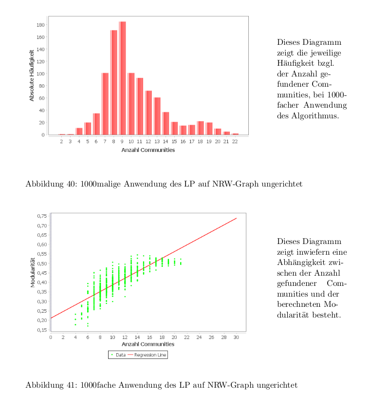
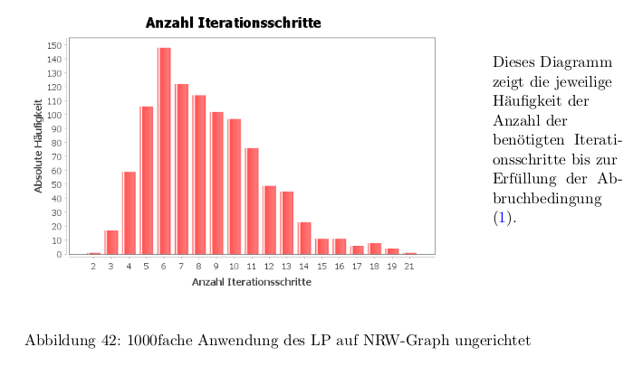

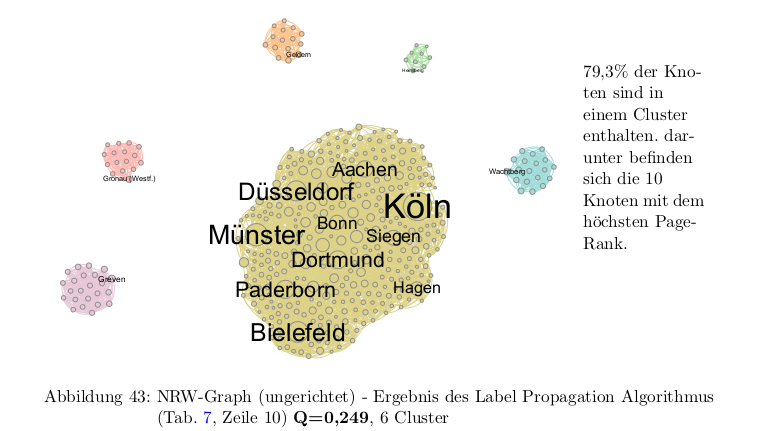
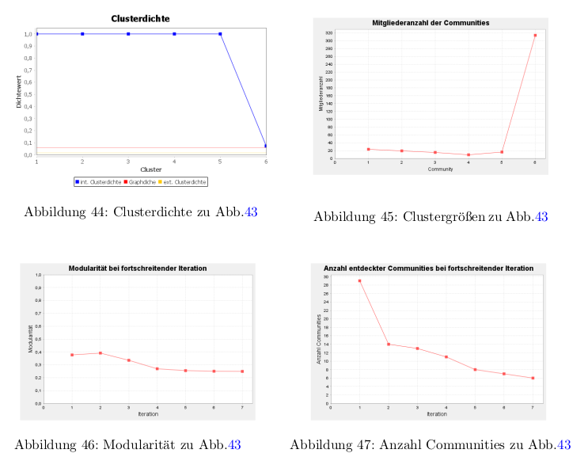
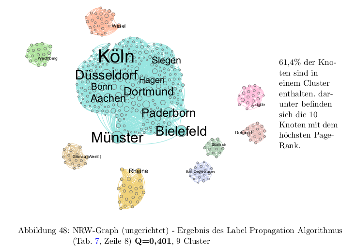
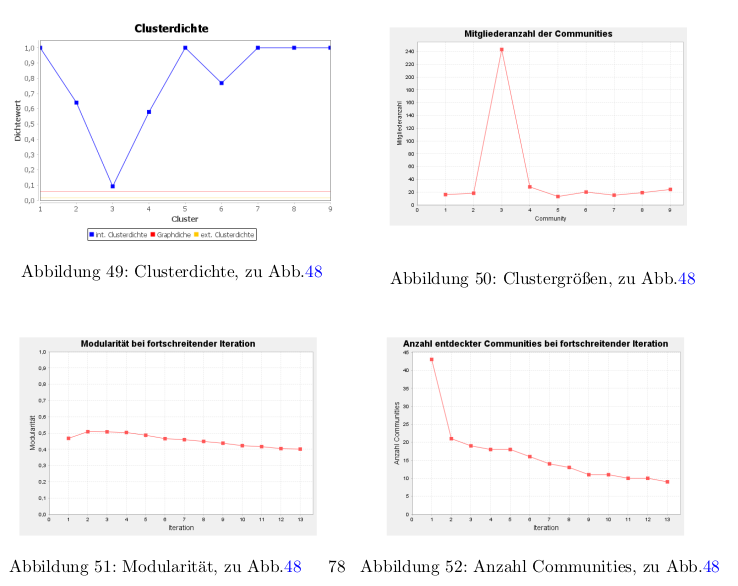
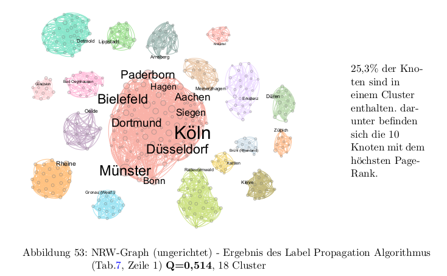
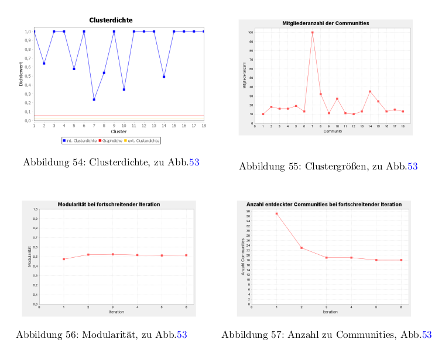
### Directed graph
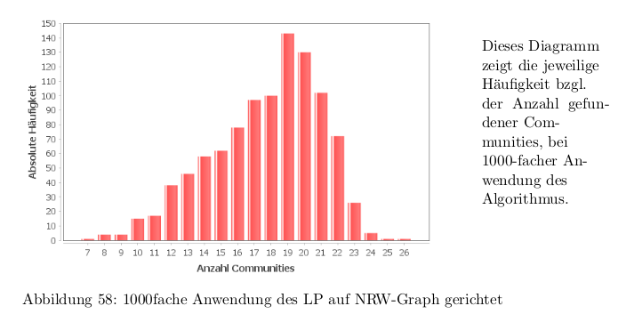
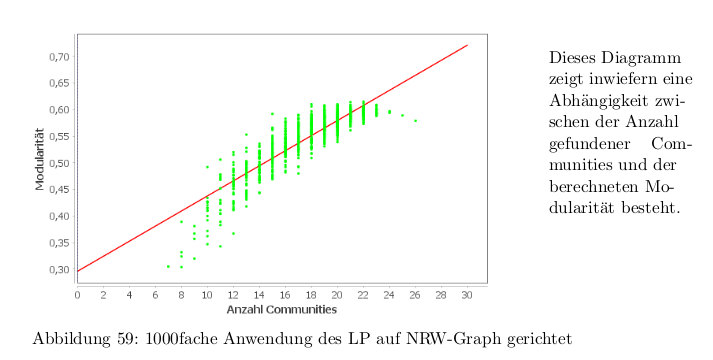
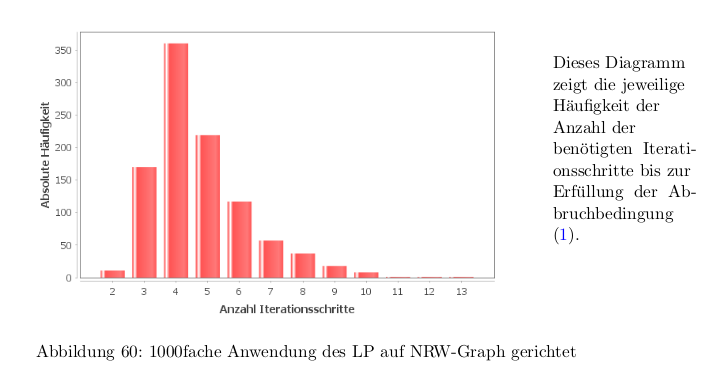
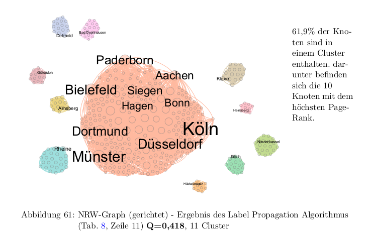
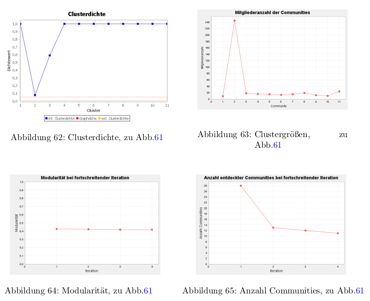
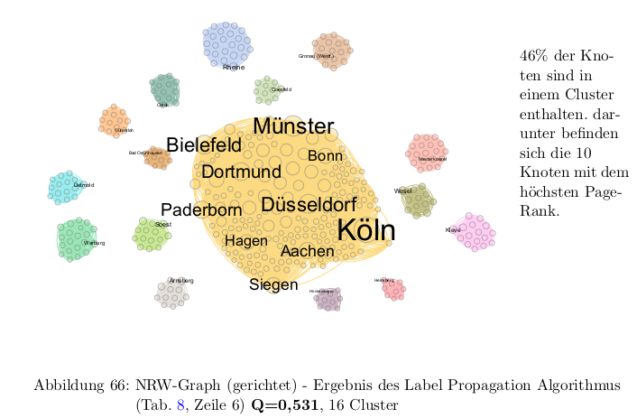
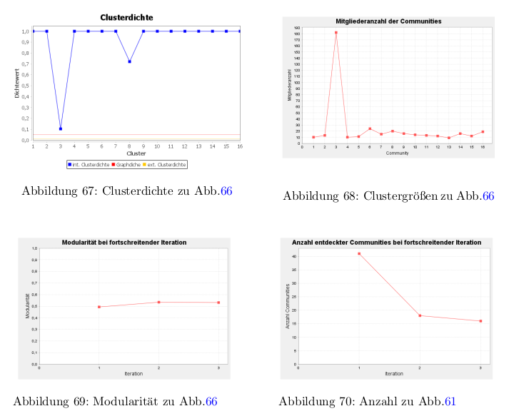
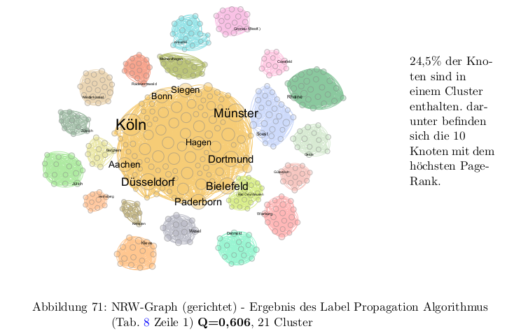
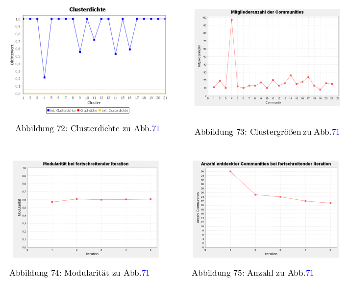

